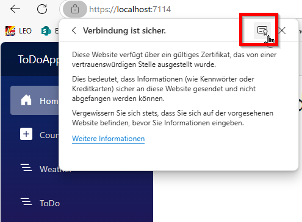
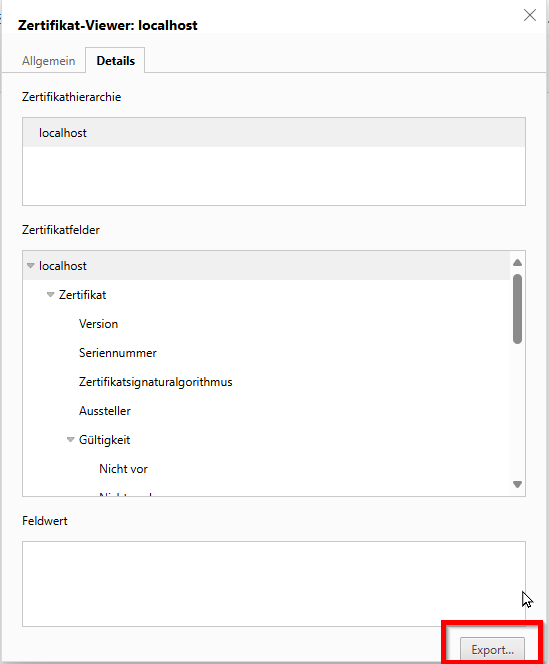

# README

## Contents

- [Neovim](#neovim)
- [Visual Studio](#visual-studio)
- [Visual Studio Code](#visual-studio-code)
- [Windows Terminal](#windows-terminal)

## Neovim

### Show local config path

```vi
:echo stdpath("config")
```


### Install C Compiler for plugins, i.e. treesitter

<https://code.visualstudio.com/docs/cpp/config-mingw>

### C# formatter

<https://csharpier.com/docs/Installation>

<https://vi.stackexchange.com/questions/45909/minimal-neovim-setup-for-c-auto-formatting-windows>

## Visual Studio

### SSL Certificate installieren

#### via Command

This will let you know if you have any valid self signed certs.

```ps
dotnet dev-certs https -c
```

This will let you know if you have any trusted self signed certs.

```ps
dotnet dev-certs https --check --trust
```

If you have expired or untrusted dev certs you can run:

```ps
dotnet dev-certs https --clean
```

If you want to add a cert/trusted cert you can run:

```ps
dotnet dev-certs https --trust
```

This will create a self signed cert and attempt to add it to the Trusted Root Certification Authorities folder.

#### or via Browser

##### Step 1 - Export Cert from browser





##### Step 2 - Import

Open Computer-Cert Management console (not User-Cert management Console)

Import into 'Trusted Root Certification Authorities':

```ps
certlm.msc
```

## Visual Studio Code

### Extensions

<https://marketplace.visualstudio.com/items?itemName=ecmel.vscode-html-css>

<https://marketplace.visualstudio.com/items?itemName=donjayamanne.githistory>

<https://marketplace.visualstudio.com/items?itemName=yzhang.markdown-all-in-one>

<https://marketplace.visualstudio.com/items?itemName=xdebug.php-debug>

<https://marketplace.visualstudio.com/items?itemName=bmewburn.vscode-intelephense-client>

## Windows Terminal

### Install a Nerd font on the OS

<https://learn.microsoft.com/en-us/windows/terminal/tutorials/custom-prompt-setup>

<https://www.nerdfonts.com/font-downloads>

Configure this new font within Windows Terminal Settings.

### Customize PowerShell-Prompt with "Oh My Posh"

<https://learn.microsoft.com/de-de/windows/terminal/tutorials/custom-prompt-setup>

An example powershell profile file can be found in "terminal/Microsoft.PowerShell_profile.ps1".

### Powershell Profile

The currently used profile path is stored with the system variable "$PROFILE".

<https://learn.microsoft.com/en-us/powershell/module/microsoft.powershell.core/about/about_profiles?view=powershell-7.3>
